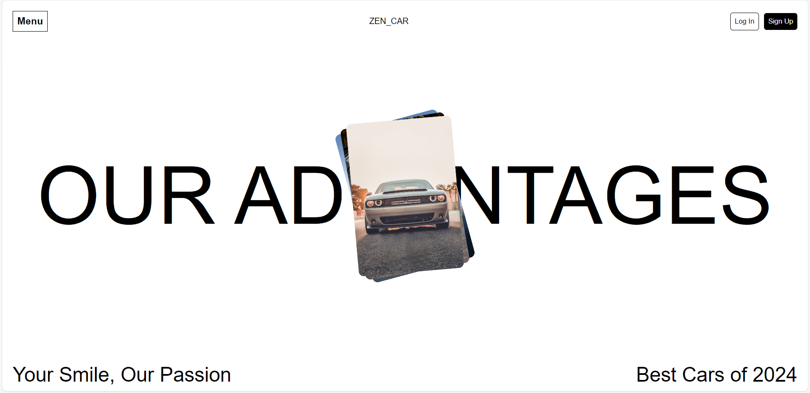

# Hero-page-practice😄

A simple Hero / Landing section built with the help of Html5 and Css3.

## About

A basic landing page for practice with the help of Html5, Css3. Where I write code for simple static nav and hero section!

## Getting Started 🛠️

To get started with this repository, follow these steps:

1. Clone the repository: `git clone https://github.com/alizainaslam/Hero-page-practice.git`
2. Open `index.html` in browser or use LIVE SERVER in vs code.

## Contributing 🤝

Always welcome for contributions! If you'd like to improve this project, or want to add more content follow these steps:

1. Fork the repository
2. Create a new branch: `git checkout -b feature/"your"-feature`
3. Make your changes and commit them: `git commit -m 'Add some commit'`
4. Push to the branch: `git push origin feature/"your"-feature`
5. Create a pull request

## Contact 📧

If you have any questions or suggestions, feel free to reach out on LinkedIn 👇:

## License 📜

This project is licensed under the MIT License - see the [LICENSE](LICENSE) file for details.

**Enjoy your coding journey! 💻**

🌟 Don't forget to give a star if you find this repository helpful! 🌟
